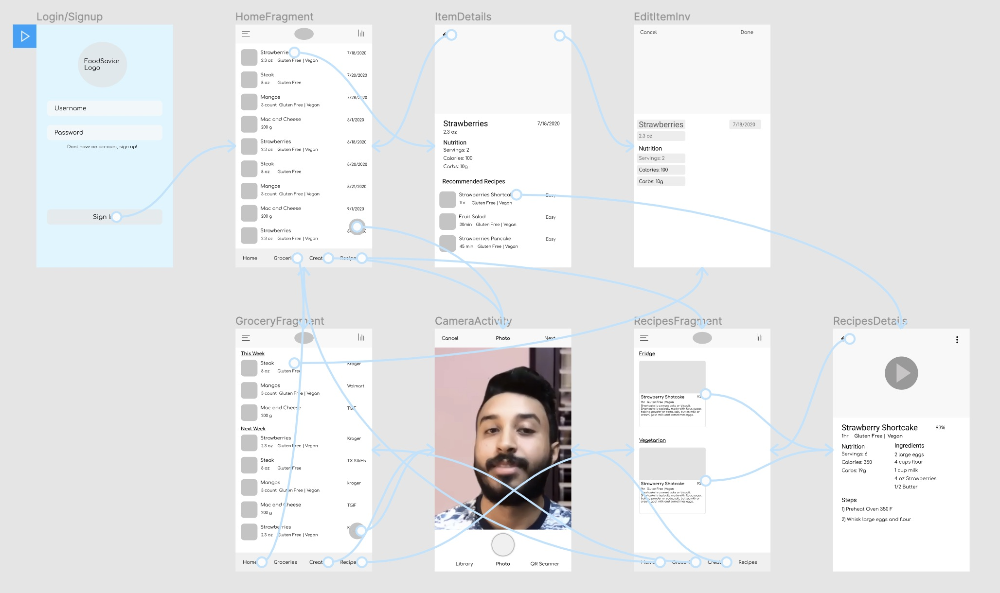
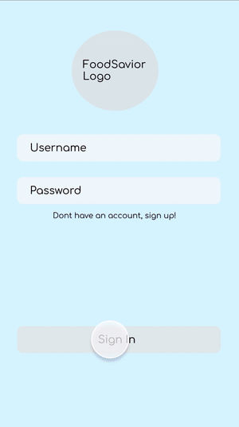

# Food Savior 

## Table of Contents
1. [Overview](#Overview)
1. [Product Spec](#Product-Spec)
1. [Wireframes](#Wireframes)
2. [Schema](#Schema)

## Overview
### Description
Food Savior helps users keep track of their food and suggests recipes using foods before they expire. 

### App Evaluation
- **Category:** Food, Health and Fitness, Environmental 
- **Mobile:** How uniquely mobile is the product experience?
    - Users will often be away from home (resturarant, grocery store, friends house, etc) when inputting food items into the app, making it impractical to access as a website. Additionally, the features of a simple grocery list interface and being able to either take pictures or scan barcodes are inherently convienent with a mobile device. 
- **Story:** How compelling is the story around this app once completed?
    - Food waste is one of the worlds worst, yet most easily avoidable problems. In the US, 40% of produed food is wasted and the majority of that food waste comes from individual consumers throwing away expired or near expired foods. Since more effiecent food consumption can decrease the CO2 intensive food production, food waste is costly both economically and environmentally. 
    - Food Savior correctly identifies one of the defining features of consumer food waste, forgeting food already bought, and helps consumers efficently manage their food inventory. In addition, Food Savior makes reaching dietary or fitness goals easier by keeping track of the nutrition of food items and presenting compatible recipies. 
- **Market:** How large or unique is the market for this app?
    - Most developed countries waste food at a much higher rate than the rest of the world and we know it. Food savior has the potential to be used by anyone, but its base of users will likely be people who are environmentally concious, looking to save money, or people who have restricted diets. 
    - For the aformentioned groups, I beleive Food Savior provides them with an easy tool to make their lives more convenient. For example, keeping track of food spending for a budget often involves multiple spreadsheets, hours of time, and at the end of the day, users will not know their food habits very accuratly. Food savior does all of this tracking and even suggests low caost meals the user never thought of. 
- **Habit:** How habit-forming or addictive is this app?
    - Often times, reminder/inventory apps become uninteresting after the first few uses as they require a lot of effort from the user and aren't too interactive. Food Savior makes managing inventory easy by
        - Easy adding: implements barcode scanning and has database of common grocery items and their nutrition
        - Easy editing/removing: edit from the home screen and suggusts certain food items be removed after executing a recipe 
        - Frequent, but not too frequent, weekly reminders of foods expiring that week 

    - An average user would use this app a 4-5 days a week especially during lunch and dinner time 
- **Scope:** How well-formed is the scope for this app?
    - The core features of this app (i.e. inventory and recipe querying) are quite interesting and seem quite reasnable to implement in 4 weeks. The recipe querying will be done using a food api (currently have a short list) and there are plenty of resources on barcode scanning on the internet (projecting this to be amoung the harder features)
    - A stripped down version of the app, such as a strict inventory app would still be somewhat interesting but I don't beleive it will get too much traction with users. Of the app market, there is an app called NoWaste which is a similar idea to Food Savior, but focused on only on inventory. The user interaction was high initially, and fizzeled out. 
    - The scope, as of now is a little ill defined. Its a combination of environmental, budgeting, and fitness apps, so I'll have to think about a good way of presenting these features together. 

## Product Spec

### 1. User Stories (Required and Optional)

**Required Must-have Stories**

* Users can sign up/register
* Users can login/logout 
* Users can check current food inventory 
* Users can sort food based on location, food type, and expiration date
* Users can click food item to edit and get details like nutrition, date of purchase, expiration date, and 5 recipes using this ingredient 
* Users can take a photo of food item and manuely add it to invetory 
* Users can Barcode scan food and add to inventory 
* Users can query recipes using food in inventory
* Users can add items to grocery list 

**Optional Nice-to-have Stories**

* Users can get fun facts about their eating habits 
* Users can set dietary goals 
* Users can track these goals 
* Users are suggested recipes based on their past eating habits 
* Users are suggested recipes based on their dietary goals/restrictions 
* Users are suggested changes to inventory for convenient and accurate food inventory 

### 2. Screen Archetypes

* Login/Signup Activity
    * Users can sign up/register
    * Users can login
* Home Activity 
   * Users can check current food inventory 
   * Users can sort food based on location, food type, and expiration date
* Details Activity 
    * Users can click food item to edit and get details like nutrition, date of purchase, expiration date, and 5 recipes using this ingredient 
    * Users can add item to grocery list

* Grocery list Acivity
    * Users can add items to grocery list 
    * View and edit items to be purchased 
    * Link Amazon order

* Camera Activity
    * Users can take a photo of food item and manuely add it to invetory 
    * Users can Barcode scan food and add to inventory  

* Recipe Activity
    * Users can query recipes using food in inventory
    * Query parameters like diet, current inventory, etc

* Profile Activity
    * Users can get fun facts about their eating habits 
    * Users can set dietary goals 

* Settings Activity
    * Logout 
    * Set profile picture 

### 3. Navigation

**Tab Navigation** (Tab to Screen)

* Home Activity &rarr; Home Options overlay 

**Flow Navigation** (Screen to Screen)

* Bottom Nav Activities navigate to 
    * Home Activity
    * Grocery list Activity
   * CameraActivity 
   * Recipes Activity
   * Profile Activity
* LoginActivity
   * Home Activity
* HomeActivity
   * Bottom Nav
   * Details Activity
* Grocery List Activity
   * Bottom Nav
* CameraActivity
   * Bottom Nav 
   * Manuel update 
   * Barcode update 
* Recipies Activity
   * Bottom Nav 
   * Query page 
   * Details on recipes 
* Profile Activity
   * Bottome Nav 
   * Settings Activity 
* Settings Activity
   * Profile Activity

## Wireframes

### Digital Wireframes & Mockups

### Interactive Prototype

## Schema 
### Models
#### User 

   | Property      | Type     | Description |
   | ------------- | -------- | ------------|
   | name      | String   | full name of user |
   | cityCountry | String| image author |
   | percentFoodConsumed | number | the percentage of total food consumed |
   | percentFoodWasted | number| the percent of total food wasted |
   | foodsMostConsumed | ArrayList<String>   | List of strings with top 5 most consumed foods |
   | foodsMostWasted | ArrayList<String>   | List of strings with top 5 most wasted foods |
   | recipesMostConsumed | ArrayList<String>   | List of strings with top 5 most consumed recipes |
   | profilePhoto    | ParseFile  | user profile photo |
   | dietaryRestrictions | ArrayList<String> | List of dietary restrictions like "vegan", "kosher", etc |
   | preferredFood     | ArrayList<String> | List of preferred food catagories like "italian", "fried", etc |

 

#### Goal

   | Property      | Type     | Description |
   | ------------- | -------- | ------------|
   | user      | Pointer to ParseUser   | user who owns this goals |
   | type | String| One of the following strings: "Fitness", "Diet", "Waste Reduction", "Carbon Footprint Reduction", "Savings", "Other" |
   | frequency | ArrayList<String> | the percentage of total food consumed |
   | duration | ArrayList<DateTime> | start and end dates for the goal|
   | description | String   | description of goal |

 

#### InventoryFood

   | Property      | Type     | Description |
   | ------------- | -------- | ------------|
   | user      | Pointer to ParseUser   | food belongs to this user|
   | name | String| name of food item |
   | amount | ArrayList<String> | zero index contains number as string, 1st index contains units |
   | location | String| location of food such as freezer, basement fridge, pantry, etc|
   | image | ParseFile | image of food|
   | brand | String | brand name of food|
   | servingSize | ArrayList<String>   | zero index is number amount as a string, 1st index is units |
   | nutrition    | ArrayList<double>  | in the order of calories, carbs, protien, fat, total sugar, sodium|
   | dietaryRestrictions | ArrayList<String> | List of dietary restrictions like "vegan", "kosher", etc |

 

#### GroceryFood

   | Property      | Type     | Description |
   | ------------- | -------- | ------------|
   | user      | Pointer to ParseUser   | food belongs to this user|
   | name | String| name of food item |
   | amount | ArrayList<String> | zero index contains number as string, 1st index contains units |
   | store | String| store which user plans to buy food at|
   | whenBuying| DateTime| date in which user plans to buy food| 
   | image | ParseFile | image of food|
   | brand | String | brand name of food|
   | servingSize | ArrayList<String>   | zero index is number amount as a string, 1st index is units |
   | nutrition    | ArrayList<double>  | in the order of calories, carbs, protien, fat, total sugar, sodium|
   | dietaryRestrictions | ArrayList<String> | List of dietary restrictions like "vegan", "kosher", etc |

 

#### PastFood

   | Property      | Type     | Description |
   | ------------- | -------- | ------------|
   | all InventoryFood attributes | - | - |
   | isWasted | Boolean| did user throw away food |
   | isConsumed| Boolean | did user consume food| 
   | frequency| number | how often user purchases food|
   | totalAmount| ArrayList<String> | zero index is number, 1st index is units| 

 

### Networking
Login: 
- (Read/GET) LoginBackground 

HomeFragment: 
- (Read/GET) Query all FoodInInventory to recyclerview 
- (Create/POST) Create FoodInInventory 
- (Delete) Delete FoodInInventory 

DetailsFragment: 
- (Read/GET) Query a FoodInInventory 
- (Read/GET) Query related recipes 

EditFragment: 
- (Update/Post) Edit any of the String fields on the FoodInInventory Item 

GroceryFragment: 
- (Read/GET) Query all FoodInGroceryList to rv
- (Create/POST) Create FoodInGroceryList 
- (Delete) Delete FoodInGroceryList  

CameraFragment: 
- (Create/Post) Launch camera and post FoodInInventory 
- (Create/Post) Launch camera and post FoodInGroceryList

RecipesFragment: 
- (Read/GET) Query recipes matching food items in inventory 
- (Read/GET) Query recipes based on food preferences 
- (Create/POST) Create new recipe 
